# EduMind Frontend #

## Product flow ##
A typical use of the product is as follows:
1. Student creates a chat with an image and a subject, and a starting question
2. A tutor accepts the chat and assigns a topic to the chat
3. Student and tutor chat until no further questions
4. Tutors closes the chat
5. Student rates the tutor

## Screens ##
### Startup Screens ###
On startup, we have the following four screens:  
Startup | Login

  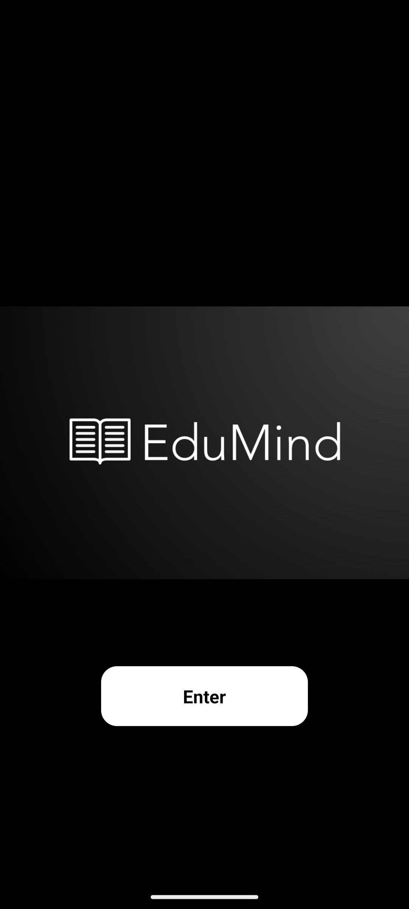
  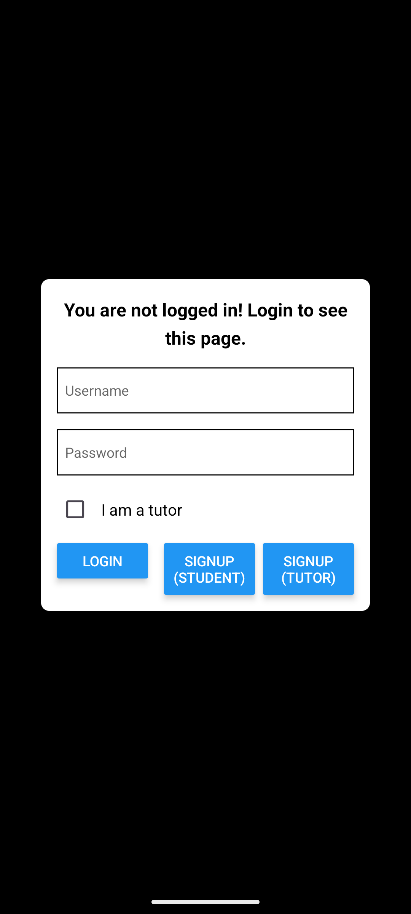

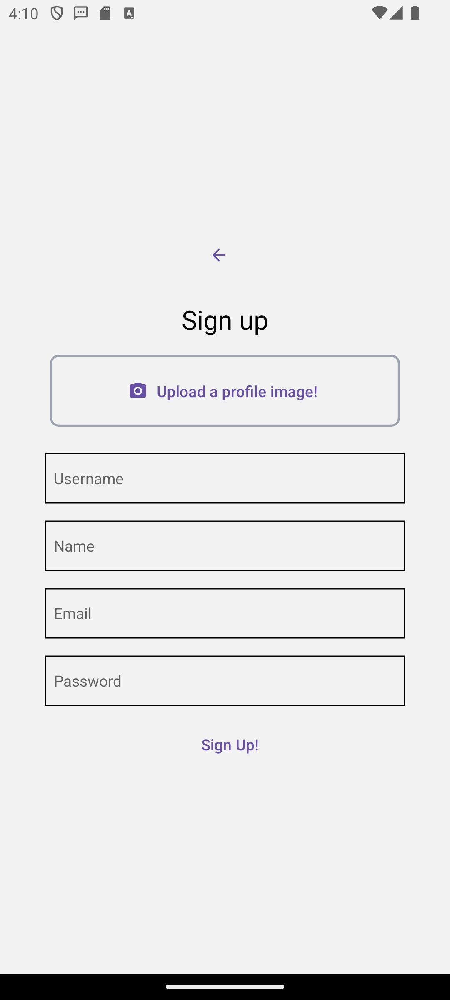
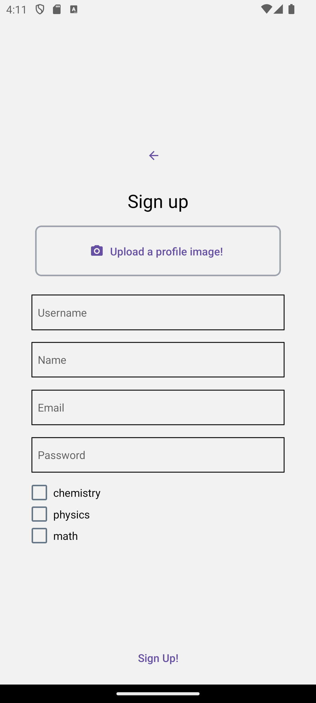

### Shared Screens ###
The following screens appear in both tutor and student views:

Chat Screen  
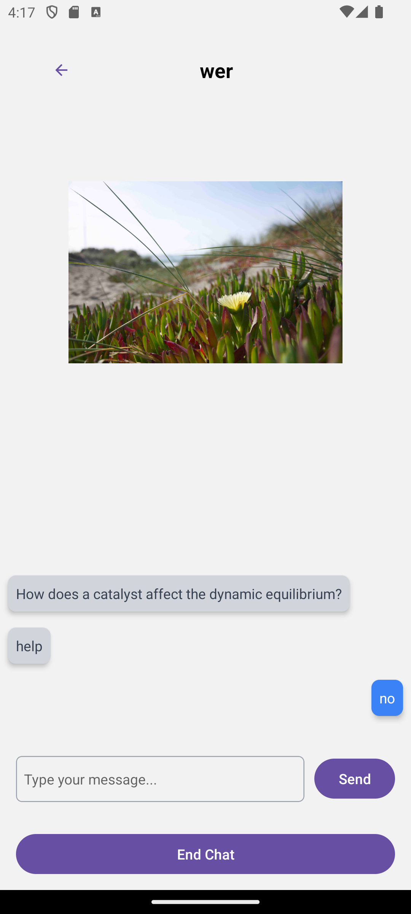

Change details screen  
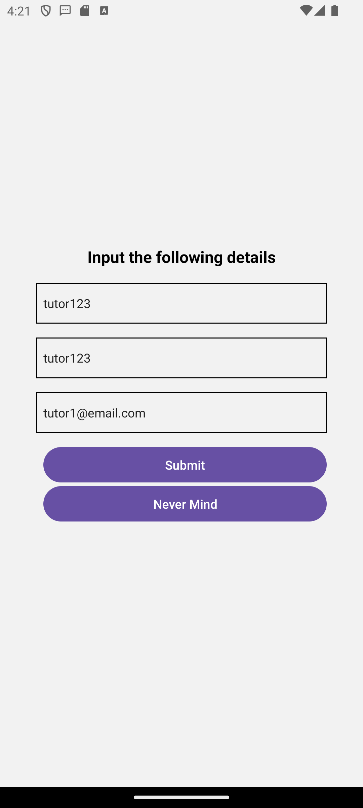

### Tutor Screens ###
Tutors have the following unique screens:

Home screen  
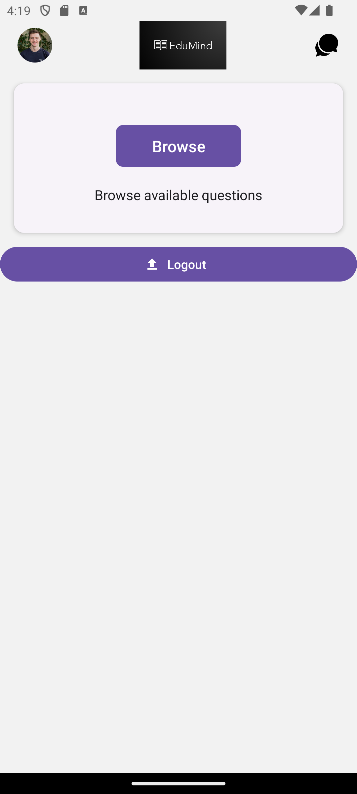
On the home screen, tutors can view available chats that are within the subjects that they have chosen and other tutors have not claimed.

Profile screen  
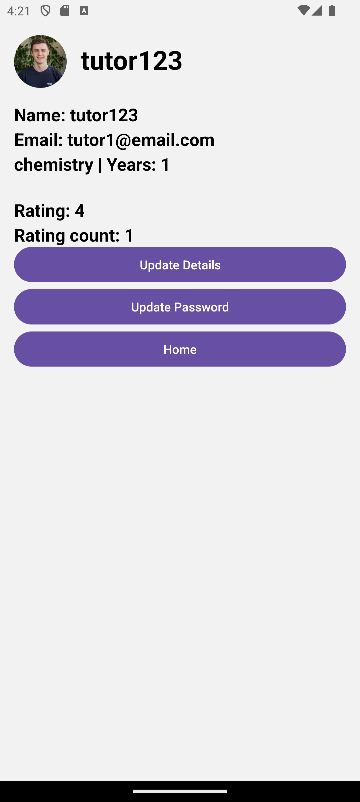
Profile screen shows tutors' basic details, as well as their experience and ratings.

Accept chats screen  
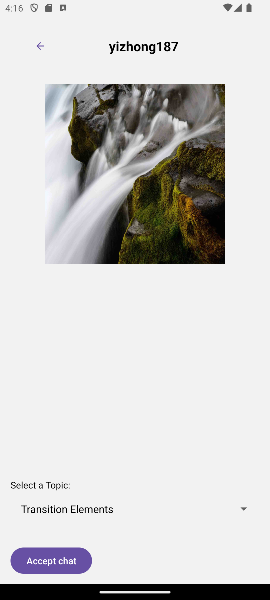
Tutors are required to assign a topic to a chat before accepting.

### Student Screens ###
Students have the following unique screens:

Home screen  
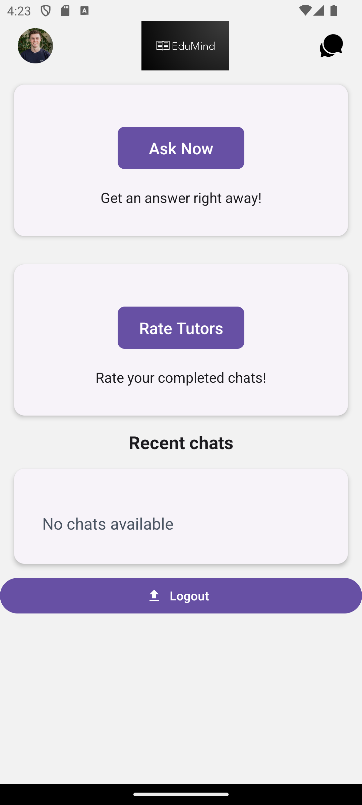
On the home screen, students can create chats, rate tutors for completed chats, as well as view recent chats.

Create chat screen  
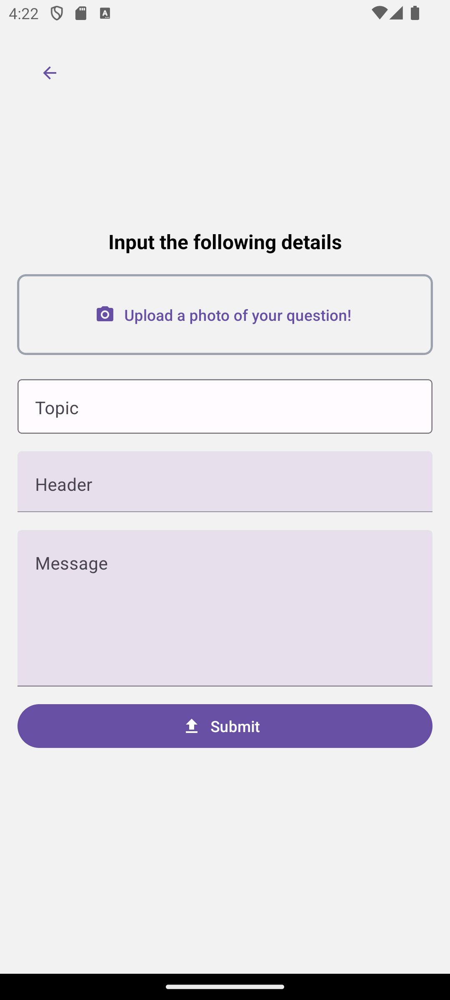
Self-explanatory create chat screen
